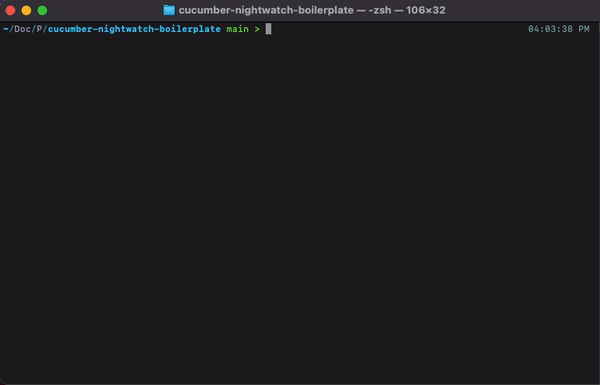

# cucumber-nightwatch-boilerplate

[Nigthwatch](https://nightwatchjs.org) is a popular open-source test automation framework.
Cucumber is the one of the popular tools that supports Behaviour Driven Development (BDD). The Cucumber built-in plugin of Nightwatch is bringing the ease of writing test scripts to BDD. 

## Overview
The test case in Cucumber are written as scenarios in simple language which then maps to code. This project shows some examples of Nightwatch end-to-end test written using Cucumber. 

## Setup 
- To run the tests in the repository
- clone the repository: `git clone https://github.com/gravityvi/cucumber-nightwatch-boilerplate.git`
- install the required dependencies `npm install`
- run the tests `npm test`


## Usage
- There are predefined cucumber steps using nightwatch commands in `src/specs`. 
- Add a feature file in `tests/features` using predefined steps and [Gherkin syntax](https://cucumber.io/docs/gherkin/).
- There are some example tests in the folder to demonstrate.
- Run your tests using `npm test`
- You can also use tags to filter out tests to run `Eg: npm test -- --tags @nightwatch`.


## Demo



## Adding Tests
You can write tests in Gherkin syntax using the predefined steps from the boilerplate. There are examples under `tests/features`to demonstrate this. You can also extend this boilerplate by defining new steps under `src/specs` to suite your usecase.


## Configuration 
Most of the cucumber options are picked through nightwatch config in order to decrease the effort while writing scripts. 

- feature path can be given as a string or an Array in the test runner options. All formats of feature path mentioned in [Cucumber CLI](https://github.com/cucumber/cucumber-js/blob/main/docs/cli.md#running-specific-features) are supported.

- Cucumber spec files/step definition files can be provided in `src_folders` in Nightwatch config or as a CLI argument.
 - With `src_folders` defined:

```sh
$ npx nightwatch 
```

 - Without `src_folders` defined:

```sh
$ npx nightwatch examples/cucumberJs/features/step_definitions 
```
- parallel option can be also supplied as a test-runner option for cucumber. 

 - Parallel running using 2 workers:

```sh
$ npx nightwatch examples/cucumberJs/features/step_definitions --parallel 2 
```

- You can use [Cucumber tag expression](https://cucumber.io/docs/cucumber/api/#tag-expressions) to filter out scenarios to run. `Eg: nightwatch --tags "@nightwatch and @cucumber"`

- You provide in env flag in order to run test againts multiple envs(chrome, browserstack, etc). `Eg: nightwatch --env chrome,firefox`

- Example:
```
 test_runner: {
    type: 'cucumber',
    options: {
      feature_path: ['examples/cucumberJs/*/*.feature', 'examples/cucumberJs/features/*.feature'],
      parallel: 2
    }
  },
```

- You can also use an extra setup file that can be passed as an extra `--require` to Nightwatch, which will be forwarded to Cucumber.
```sh
$ nightwatch src/specs --require {/full/path/to/_extra_setup.js}
```

- Nightwatch will also forward `--format` and `--format-options` CLI arguements, if present, to Cucumber.

